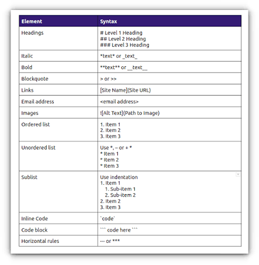
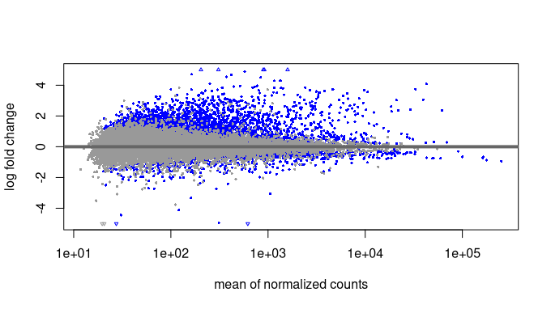
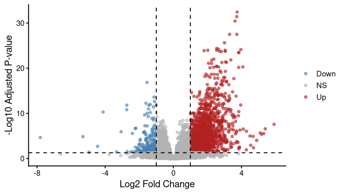
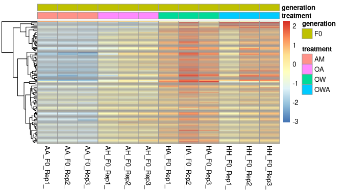
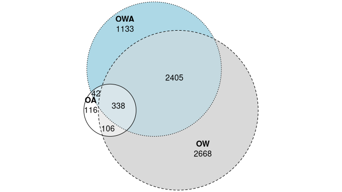
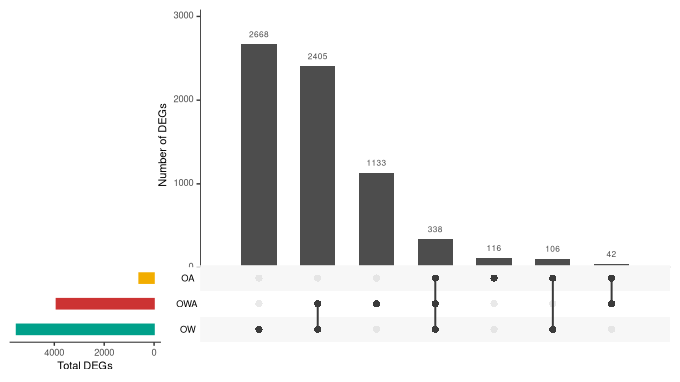
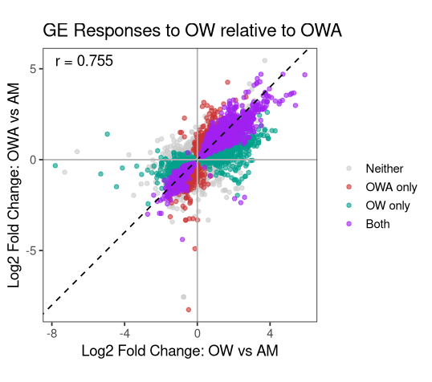

# Transcriptomics Notebook

**Course:** Intro to Ecological Genomics - Fall 2026

**Name:** Anna Smith

------------------------------------------------------------------------

## 9/15/2026 - Setting up lab notebook and learning markdown

-   setting up transcriptomics notebook

-   Learn how to take notes in markdown

-   push notes to github

**Working Directory**

`/gpfs1/home/a/s/asmit168/eco_genomics_2026/transcriptomics`

**Input Files**

`none`

**Output Files**

`/gpfs1/home/a/s/asmit168/eco_genomics_2026/transcriptomics/Transcriptomics_Notebook.md`

**Programs and dependencies:**

-   `R version 4.5.1`

-   `R-Studio`

**Scripts:**

`none`

**Code:** essentials/shortcuts to know

``` r
# pwd for my home directory
/gpfs1/home/a/s/asmit168/eco_genomics_2026

# BASH commands and what they mean
print working directory (pwd) #= where am I? Will show you whole path
Zcat #= will open/print whole file (DO NOT DO); pipe (|) to head = just top of file
Cd #= change directory (.. moves you back a directory, . means from where you currently are)
 Ll #= list long (gives more info about each file than ls)
Ls #= list (what is here?)
History #= prints everything you have typed recently in the session (prints all past commands)
Arrow key up #= gives you past commands; keep arrowing to keep going further back
Tab button #= fill in the rest of the input based on what files are there in the directory (saves you from typos)
Cp #= copy something
Rm #= remove something (be careful!)
~ # = home directory shortcut
```

**Table:**

| Col1 | Col2 | Col3 |
|------|------|------|
|      |      |      |
|      |      |      |
|      |      |      |

{width="588"}

**Notes/Observations**:

oh cool graph, yay! And some interpretation of what you are seeing, maybe what the next step could be?

**Next Steps?**

-   Lets dive into the project!

------------------------------------------------------------------------

## 9/17/2026 - Introduce the study system

-   Understand the experimental design and data and questions that can be addressed with these data.

-   Understand what a .fastq file is.

-   Understand the work flow or “pipeline” for processing and analyzing RNAseq data.

-   Conceptualize a “counts” file.

**Working Directory**

`/gpfs1/home/a/s/asmit168/eco_genomics_2026/transcriptomics`

**Input Files**

`none`

**Output Files**

`/gpfs1/home/a/s/asmit168/eco_genomics_2026/transcriptomics/Transcriptomics_Notebook.md`

**Programs and dependencies:**

-   `R version 4.5.1`

-   `R-Studio`

**Scripts:**

`none`

**Code:**

``` r
# Useful commands for later in shell access of VACC

# to get to class directory
cd /gpfs1/cl/biol3990

# to get list of what is in directory (ls short, ll long)
ls
ll

# take the output of zcat (reads a gzipped file; AA...qz file) and give me (|) this number of lines (-n 8) - output is the first few lines of the quality of the reads
zcat AA_F0_Rep3_2_clean.fq.gz | head -n 8

#DO NOT run the above file without adding | (pipe) aka filtering it thru a secondary command.... or else computer may explode

# tell me how many lines are in this file
zcat AA_F0_Rep3_2_clean.fq.gz | wc -l
```

------------------------------------------------------------------------

## 9/22/2026 - Gene expression analysis

-   Get set up with your Rstudio working environment, your repo, data files, and script.

-   Continue working in your .rmd file to keep your differential gene expression analysis notes together and annotated.

-   Import the counts matrix into DESeq2 Visualize reads and variation.

-   Visualize global variation in gene expression using Principal Component

-   Analysis (PCA) and other data visualization tools.

**Working Directory**

`/gpfs1/home/a/s/asmit168/eco_genomics_2026/transcriptomics`

**Input Files**

`none`

**Output Files**

`/gpfs1/home/a/s/asmit168/eco_genomics_2026/transcriptomics/Transcriptomics_Notebook.md`

**Programs and dependencies:**

-   `R version 4.5.1 (tidyverse)`

-   `R-Studio`

-   module commands: `load ecogen-rlibs`

**Scripts:**

`created ahud_DESew2_inclass.R in my scripts`

**Code:**

``` r
# change directory to class (in shell access)
cd /gpfs1/cl/ecogen/./setup.sh

source ~/.bashrc

# added ./transcriptomics/mydata to .gitignore and pushed (back to R now)

# test that above worked
touch ./myresults/somethingThatShouldAppear.txt
git status

# this did not appear as something that needs to be pushed, meaning git is not tracking these files
----------------------------------------------------------------------------------
#Copy the data files to your mydata directory
  
/gpfs1/cl/biol3990/Transcriptomics/CountsMatrix
cp * ~/eco_genomics_2026/transcriptomics/mydata

# Cp is asking what am I grabbing (* = everything for what directory you are currently in) and where are we putting it (navigates to mydata)... there they are!
## the files are ahud... and salmon.isoform...
---------------------------------------------------------------------------------
# opened a new Rscript to import libraries and data, saved to myscripts
## Set your working directory
setwd("~/projects/eco_genomics_2026/Transcriptomics")

## Import the libraries that we're likely to need in this session

####################################################

### Import our data

####################################################

 
# Import the counts matrix

countsTableRound <- round(countsTable) # bc DESeq2 doesn't like decimals (and Salmon outputs data with decimals)

#import the sample description table

# WHAT ABOVE CODE DOES: loaded libraries, imported the counts matrix, round off decimals from counts table, open conditions table

### WHAT IS THE COUNTS TABLE? - for a given gene and rep, number is how many reads there were for that given transcript/gene... some transcripts will have higher numbers/expressions than others. 

####################################################

### Explore data distributions

####################################################

# Let's see how many reads we have from each sample

# generate a plot of total number of read counts we have for each sample, fairly even for all

# the average number of counts per gene

apply(countsTableRound,2,mean) # 2 in the apply function does the action across columns
apply(countsTableRound,1,mean) # 1 in the apply function does the action across rows
# generate histogram displaying mean counts for each gene, most have very few, but long tail means some will have large numbers of reads
hist(apply(countsTableRound,1,mean),xlim=c(0,1000), ylim=c(0,60000),breaks=10000)

-----------------------------------------------------------------------------------
  # Define our model and create a DESeq2 object

#################################################### 

### Start working with DESeq2!

####################################################

#### Create a DESeq object and define the experimental design here with the tilda

# Filter out genes with too few reads - remove all genes with counts < 15 in more than 75% of samples, so ~28)
## suggested by WGCNA on RNAseq FAQ

dds <- dds[rowSums(counts(dds) >= 15) >= 28,]
nrow(dds) 
# [1] 25260, that have at least 15 reads (a.k.a counts) in 75% of the samples

# Run the DESeq model to test for differential gene expression
dds <- DESeq(dds)

# WHAT IS ABOVE DOING: scaling everything == estimate size factors, estimate dispersions = how variable is gene expression for a given transcript

# List the results you've generated
resultsNames(dds)
## WHAT ABOVE CODE RAN
# [1] "Intercept"            "generation_F11_vs_F0" "generation_F2_vs_F0" 
# [4] "generation_F4_vs_F0"  "treatment_OA_vs_AM"   "treatment_OW_vs_AM"  
# [7] "treatment_OWA_vs_AM"
-----------------------------------------------------------------------------------
## Now lets transform our data so we can make a PCA plot
# Check the quality of the data by sample clustering and visualization

# The goal of transformation "is to remove the dependence of the variance on the mean, particularly the high variance of the logarithm of count data when the mean is low."

# this gives log2(n + 1)
ntd <- normTransform(dds)
meanSdPlot(assay(ntd))

# Variance stabilizing transformation
vsd <- vst(dds, blind=FALSE)
meanSdPlot(assay(vsd))
## ABOVE is a standard plot to visualize variance, overall more variation in lower expressed genes

### Look for outliers in sample ###

sampleDists <- dist(t(assay(vsd)))

library("RColorBrewer")
sampleDistMatrix <- as.matrix(sampleDists)
rownames(sampleDistMatrix) <- paste(vsd$line, vsd$generation, sep="-")
colnames(sampleDistMatrix) <- NULL
colors <- colorRampPalette( rev(brewer.pal(9, "Blues")) )(255)
pheatmap(sampleDistMatrix,
         clustering_distance_rows=sampleDists,
         clustering_distance_cols=sampleDists,
         col=colors)

# Note any outliers: maybe one from AH (OA) F2... AH_F2_Rep2
# This plot should help us see outlier better
sampleTree <- hclust(dist(sampleDists), method="average")
# plot
plot(sampleTree, main="Sample clustering to detect outliers", sub="", xlab="",cex.lab=1.5, cex.axis=1.5, cex.main=2)
# we will leave the outlier for now, but good to note

### PCA to visualize global gene expression patterns ###

# first transform the data for plotting using variance stabilization
vsd <- vst(dds, blind=FALSE)

pcaData <- plotPCA(vsd, intgroup=c("treatment","generation"), returnData=TRUE)
percentVar <- round(100 * attr(pcaData,"percentVar"))

# visualize all data from all 4 treatment groups and generations in one plot
ggplot(pcaData, aes(PC1, PC2, color=treatment, shape=generation)) +
  geom_point(size=3) +
  xlab(paste0("PC1: ",percentVar[1],"% variance")) +
  ylab(paste0("PC2: ",percentVar[2],"% variance")) + 
  coord_fixed()

## From here we can play around with colors and shapes to optomize the data visualization.

###############################################################

# Let's plot the PCA by generation in four panels

data <- plotPCA(vsd, intgroup=c("treatment","generation"), returnData=TRUE)
percentVar <- round(100 * attr(data,"percentVar"))

###########  
# Just looking at F0 generation
dataF0 <- subset(data, generation == 'F0')

F0 <- ggplot(dataF0, aes(PC1, PC2)) +
  geom_point(size=10, stroke = 1.5, aes(fill=treatment, shape=treatment)) +
  xlab(paste0("PC1: ",percentVar[1],"% variance")) +
  ylab(paste0("PC2: ",percentVar[2],"% variance")) +
  ylim(-10, 25) + xlim(-40, 10)+ # zoom for F0 with new assembly
  scale_shape_manual(values=c(21,22,23,24), labels = c("Ambient", "Acidification","Warming", "OWA"))+
  scale_fill_manual(values=c('#6699CC',"#F2AD00","#00A08A", "#CC3333"), labels = c("Ambient", "Acidification","Warming", "OWA"))+
  theme_bw() +
  theme(legend.position = "none") +
  theme(panel.border = element_rect(color = "black", fill = NA, size = 4))+
  theme(text = element_text(size = 20)) +
  theme(legend.title = element_blank())

# just looking at F0 generation, strong clustering by treatment groups
F0
# Above graph portrays developmental plasticity, how do they respond to environment

################# F2

dataF2 <- subset(data, generation == 'F2')

F2 <- ggplot(dataF2, aes(PC1, PC2)) +
  geom_point(size=10, stroke = 1.5, aes(fill=treatment, shape=treatment)) +
  xlab(paste0("PC1: ",percentVar[1],"% variance")) +
  ylab(paste0("PC2: ",percentVar[2],"% variance")) +
  ylim(-40, 25) + xlim(-50, 55)+
  scale_shape_manual(values=c(21,22,23), labels = c("Ambient", "Acidification","Warming"))+
  scale_fill_manual(values=c('#6699CC',"#F2AD00","#00A08A"), labels = c("Ambient", "Acidification","Warming"))+
  theme(legend.position = c(0.83,0.85), legend.background = element_blank(), legend.box.background = element_rect(colour = "black")) +
  guides(shape = guide_legend(override.aes = list(shape = c( 21,22, 23))))+
  guides(fill = guide_legend(override.aes = list(shape = c( 21,22, 23))))+
  guides(shape = guide_legend(override.aes = list(size = 5)))+
  theme_bw() +
  theme(legend.position = "none") +
  theme(panel.border = element_rect(color = "black", fill = NA, size = 4))+
  theme(text = element_text(size = 20)) +
  theme(legend.title = element_blank())

# just looking at F2 generation, some more separation of the warming (diamond)
F2

# Yes - F2 is missing one ambient replicate

################################ F4

dataF4 <- subset(data, generation == 'F4')

F4 <- ggplot(dataF4, aes(PC1, PC2)) +
  geom_point(size=10, stroke = 1.5, aes(fill=treatment, shape=treatment)) +
  xlab(paste0("PC1: ",percentVar[1],"% variance")) +
  ylab(paste0("PC2: ",percentVar[2],"% variance")) +
  ylim(-40, 25) + xlim(-50, 55)+ # limits with filtered assembly
  scale_shape_manual(values=c(21,22,23,24), labels = c("Ambient", "Acidification","Warming", "OWA"))+
  scale_fill_manual(values=c('#6699CC',"#F2AD00","#00A08A", "#CC3333"), labels = c("Ambient", "Acidification","Warming", "OWA"))+
  guides(shape = guide_legend(override.aes = list(shape = c( 21,22, 23, 24))))+
  guides(fill = guide_legend(override.aes = list(shape = c( 21,22, 23, 24))))+
  guides(shape = guide_legend(override.aes = list(size = 5)))+
  theme_bw() +
  theme(legend.position = "none") +
  theme(panel.border = element_rect(color = "black", fill = NA, size = 4))+
  theme(text = element_text(size = 20)) +
  theme(legend.title = element_blank())
# Just looking at F4 generation, largely overlapping, synchronized/homeostasis reached
F4


################# F11

dataF11 <- subset(data, generation == 'F11')

F11 <- ggplot(dataF11, aes(PC1, PC2)) +
  geom_point(size=10, stroke = 1.5, aes(fill=treatment, shape=treatment)) +
  xlab(paste0("PC1: ",percentVar[1],"% variance")) +
  ylab(paste0("PC2: ",percentVar[2],"% variance")) +
  ylim(-45, 25) + xlim(-50, 55)+
  scale_shape_manual(values=c(21,24), labels = c("Ambient", "OWA"))+
  scale_fill_manual(values=c('#6699CC', "#CC3333"), labels = c("Ambient", "OWA"))+
  guides(shape = guide_legend(override.aes = list(shape = c( 21, 24))))+
  guides(fill = guide_legend(override.aes = list(shape = c( 21, 24))))+
  guides(shape = guide_legend(override.aes = list(size = 5)))+
  theme_bw() +
  theme(legend.position = "none") +
  theme(panel.border = element_rect(color = "black", fill = NA, size = 4))+
  theme(text = element_text(size = 20)) +
  theme(legend.title = element_blank())
# At just F11, clusters separate by treatment group again
F11


# png("PCA_F11.png", res=300, height=5, width=5, units="in")
# 
# ggarrange(F11, nrow = 1, ncol=1)
# 
# dev.off()

# put it all together into one plot to look at all 4 plots together
ggarrange(F0, F2, F4, F11, nrow = 2, ncol=2)
# now we can visually track expression/behavior patterns as generations progress

## some evolution may have happened across generations, due to shift in treatment cluster locations

# save the graph we just generated as a png file
png("./myresults/PCA_allGens.png", res=300, height=5, width=5, units="in")

ggarrange(F0, F2, F4, F11, nrow = 2, ncol=2)

dev.off()

# this png file now is in myresults... displayed below!
```

**Final PCA From Today**


------------------------------------------------------------------------

## 9/24/2026 - Basic R commands

-   learned what basic commands in R do

-   Learn more R syntax

**Working Directory**

`/gpfs1/home/a/s/asmit168/eco_genomics_2026/transcriptomics`

**Input Files**

`none`

**Output Files**

`/gpfs1/home/a/s/asmit168/eco_genomics_2026/transcriptomics/Transcriptomics_Notebook.md`

**Programs and dependencies:**

-   `R version 4.5.1 (tidyverse)`

-   `R-Studio`

-   module commands: `load ecogen-rlibs`

**Scripts:**

**Code:**

``` r

x <- 5
students <- data.frame(
  name = c("A", "B", "C"),
  height = c(62, 68, 72)
)


head(students)
class(students)
str(students)
# in this list (names), give me the first thing
students$name[1]
# give me the first row, second column
students[1,2]
```

------------------------------------------------------------------------

## 9/29/2026 - Differential gene expression analysis

-   Analyze and visualize the counts matrix using a simplied data set (just generation F0).

-   Understand what a contrast is. What is up- versus down-regulation?

-   Learn how to make the various common types of differential gene expression visualizations.

**Working Directory**

`/gpfs1/home/a/s/asmit168/eco_genomics_2026/transcriptomics/mydata`

**Input Files**

`none`

**Output Files**

`/gpfs1/home/a/s/asmit168/eco_genomics_2026/transcriptomics/Transcriptomics_Notebook.md`

**Programs and dependencies:**

-   `R version 4.5.1 (tidyverse)`

-   `R-Studio`

-   module commands: `load ecogen-rlibs`

**Scripts:**

`created 9.29.26_AHUD_DESEQpt2.R in my scripts`

**Code:**

``` r
#### explanations of coding in 9.29.26_AHUD_DESEQpt2 script ####

# set directory to mydata
setwd("/gpfs1/home/a/s/asmit168/eco_genomics_2026/transcriptomics/mydata")

####################################################

### Import our data

####################################################

# import counts matrix, round to a whole number, and import the sample treatments table (includes metadata (conds))

# generate dds = pared down version of countstable for only good quality data

# focus on only F0 generation for first PCA

# generate dds_F0 for filtered data just for individuals in F0, allowing us to only highlight impact of treatment without impact of generation complicating things

####################################################

### Check on the DE results from the DESeq 

####################################################

# the three comparisons of treatments: "treatment_OA_vs_AM"  "treatment_OW_vs_AM"  "treatment_OWA_vs_AM"

# Looking at the results of comparing OWA vs AM, ordering by the most significant values first, overall isolating those specific results on their own

# do above 2x more times for other two treatments

# # OA has a much weaker impact of differential expression compared to OW

### plot individual genes ###

# padj = adjusted p value, used to select genes with most significant p value

# we pulled out one gene that is likely highly differentially expressed across all treatments to see how the count differs across all treatments. The count is lowest for AM (duh), fairly low for OA, and about the same for OW and OWA (makes sense, the OW is carrying in OWA)

# making an MA plot; ambient is the 0 line, dots show how different each genes are from ambient, majority positive upregulation rather than downregulation when responding to ocean warming

# making a volcano plot; a lot more upregulation compared to downregulation, but this plot factors in p value/significance, colors are significant and grey is not

# make a heatmap of the to differentially expressed genes; OW has a lot more upregulation, similar but a bit less for OWA, and more downregulation for AM; organized by genes that are being similarly expressed (tree format)

#### PLOT OVERLAPPING DEGS IN VENN EULER DIAGRAM ####
# venn diagram but scaled to size of values of each compartment

# ! = not keep ... anything without an adjusted p value
# grab degs in each individual treatment comparison
# OW has most DEGS compared to other two treatments (broad pattern os continuing)
# manually calculating values for each section of the venn diagram
# OA is tiny, lots of genes overlapping between OWA and OW, as well as a lot in OW alone

# make an upset plot; order DEGS by frequency in which they appear, shows same info from euler plot in a diff context, bars show number of degs, sorted by combinations of treatments (each bar is a section of the euler plot), organized by most - least. 
```

**Plots**:\
MA plot



volcano plot



Heatmap



Euler Plot



Upset Plot



------------------------------------------------------------------------

## 10/01/2026 - DGEA wrap up, GO and maybe WGCNA analyses

-   Build on the analyses started in the last tutorial focused on generation F0.

-   Understand how a scatter plot can be used to compare expression responses to OW relative to OWA (each vs. AM control)

-   Understand how gene ontology (GO) functional enrichment analysis works;

-   perform GO analyses using TopGO Understand Weighted Gene Correlation Network Analysis ((WGCNA));

-   perform WGCNA analyses

**Working Directory**

`/gpfs1/home/a/s/asmit168/eco_genomics_2026/transcriptomics/mydata`

**Input Files**

`none`

**Output Files**

`/gpfs1/home/a/s/asmit168/eco_genomics_2026/transcriptomics/Transcriptomics_Notebook.md`

**Programs and dependencies:**

-   `R version 4.5.1 (tidyverse)`

-   `R-Studio`

-   module commands: `load ecogen-rlibs`

**Scripts:**

`continuing in``9.29.26_AHUD_DESEQpt2.R in my scripts`

**Code:**

``` r
### In the script "9.29.26_AHUD_DESEQpt2.R" in myscripts ###

# First, setwd and load in all the libraries, as well as import the data, filter the data, run the DESeq model, and define your results dataframes before proceeding below… basically run all of the code before the first plot, as those past plots do not need to be regenerated

#################################################################

#### Scatter plot to assess how correlated are responses to OWA vs OW?

#################################################################

# pulling out log fold change and adjusted p values from results of OWAvsAM and OWvsAM, 

#then merge these two "plot" dataframes we just created into one, merged it by gene

# We then want to filter this, as we do not want datapoints that do not have a LFC as this would mess with the plot

# classify significance = tells you a sequence of events to do, mutate function will create a new variable in the dataframe (new column = SigGroup), so we create "SigGroup" by case when (if/else), 

# calculate correlation between LFC of OWA and OW using the correlation function so we can later plot it

# for plotting purposes, we want to sort by significance, we want neither on bottom as it is least significant, and maybe put both on top, define then arrange

# use ggplot to generate the plot, aes = aesthetics (pretty plot), define variables to axis and how to color them, point plot, alpha is transparency, then point sizes, annotate function displays text (r value/correlation) and tell it where to display on the plot (code line 342), label axes, set text size, etc. 

# ggplot plots each point on scatterplot in layers, and it plots everything in order, so you want to put what is most important to see in the front, so list it first, or else neither (gray) dots will fill your plot, making it useless. (code on line 316... levels)

# can make a scatterplot to compare any two treatments!

# This sequence of actions is actually a great demonstration of a typical genomics workflow:

# Filter the data.
# Annotate/Classify the genes.
# Order the results.
# Visualize with ggplot.
```

**Plots:**

scatter plot



Interpretation:

-   both follows 1:1 line well, because they have similar LFC for both up and down regulated in both treatments (duh, its both)

-   pinwheel/symmetrical coloration = due to the way we are comparing treatments on axes

-   red = follows vertical axis which is its own treatment

-   green = follows horizontal axis which is its own treatment

-   overall, data is aligning how we would expect for what is significant in a given treatment

-   some grey points have a lot of variation among replicates, making them not significant even if they have differential LFC in each treatment.
